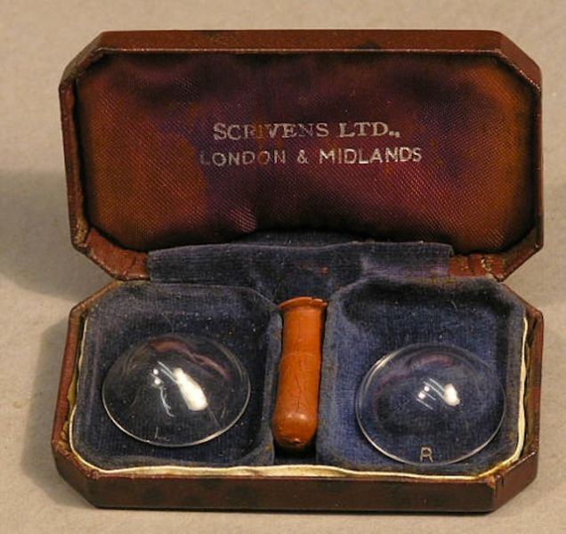

class: center, middle

# Web Components Aren't .weird[Weird] Anymore

### Matt Steele

---
class: bigimg, middle


---
class: bigimg, middle


---
class: bigimg, middle


---
class: bigimg, middle



---

class: center, middle

# .weird[Weird]ness

---
class: center, middle

# Web Components

--

## (Custom HTML Elements)

--

## They Are Awesome

---

# Demo - Joy-Con component

---

# They Just Work
--

- Easy to use
???
No compile or Webkit necessary
--

- Uses the platform
--

- Works everywhere

---
class: center, middle

# Except They _Don't_ Just Work

---

# Web Component .weird[Weirdness]
--

## No One Implemented


???
At least 50k
---
# Web Component .weird[Weirdness]

## Take Me Down To The Polyfill City
---
# Web Component .weird[Weirdness]

## Framework Lock-In

.center[]
???
---
# Web Component .weird[Weirdness]

## Bespoke Tooling

* HTML Imports
* Bower
* Custom Build Tools
---

class: center, middle
# No wonder React won

---
class: bratz, center, middle

# Five Years Later

---

# .weird[Weird] stuff jettisoned

---

# .weird[Weird] stuff jettisoned

* ~~HTML Imports~~ ➡️ ES Modules
--

* ~~Bower~~ ➡️ NPM
--

* Webpack ✅

---
class: image-list, center, middle

# Browser Implemented


---

# Vanilla Custom Elements

```javascript
class HelloWorld extends HTMLElement {
  connectedCallback() {
    this.render();
  }

  render() {
    this.innerHTML = `<div>Hello World!</div>`;
  }
}
customElements.define('hello-world', HelloWorld);
```
---
class: image-list, center, middle

# Or add some sugar


---

# Stencil


* Code with TypeScript
* Use JSX
* Reactive Data Binding
* Disappearing Framework

---

# Code example: joy-con

---

# Your framework exports them

* Angular Elements
* Vue
* Dojo
* React (with a wrapper)

---

# Use them in your apps

* Great as "leaf nodes"

---

# Github-Driven-Development


---

# Others are using it

- 📹 YouTube 
- 🚂 UPRR 
- ✨ Stellar 

---
class: center, middle

# Try Web Components Out

## It's better than an eyeball full of glass

---
class: center, middle

# Web Components Aren't .weird[Weird] Anymore

## Matt Steele
### @mattdsteele